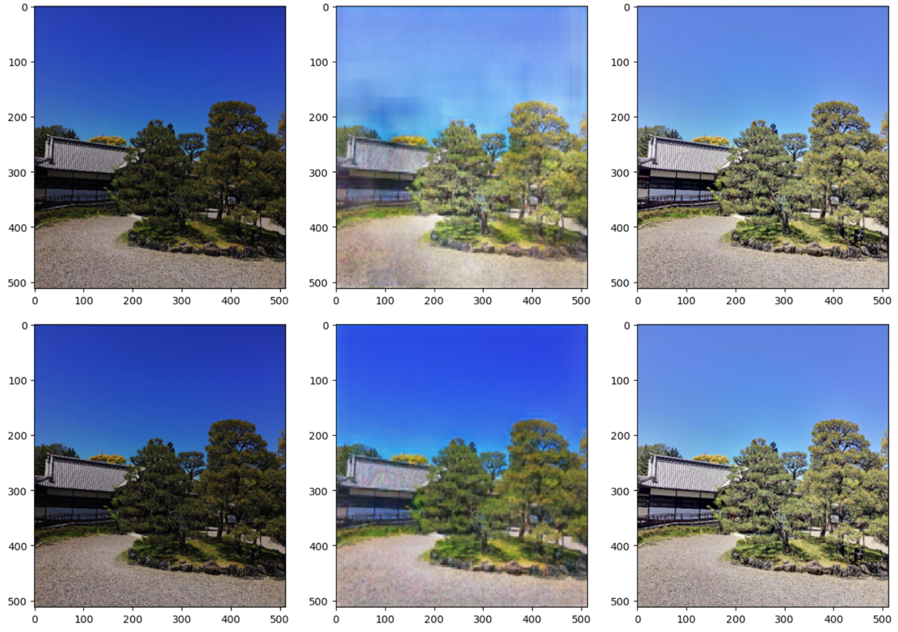

# HDR Imaging — Single-Exposure LDR → HDR with a GAN + Attention

Reconstructing **high-dynamic-range (HDR)** images from a single **low-dynamic-range (LDR)**
photograph, using a generative adversarial network whose generator is a U-Net with an
attention module at the bottleneck.

This repository accompanies my specialization thesis (2022). Single-exposure HDR
reconstruction is cheap (one image, no alignment/fusion) but tends to produce checkerboard
artefacts and unnatural textures in saturated regions. The idea here is to let a GAN learn
the distribution of luminance and contrast while **attention** focuses the network on the
regions that matter — recovering plausible detail in dark/blown-out areas without the usual
artefacts.

📄 Full write-up: [`docs/paper.md`](docs/paper.pdf) (Portuguese).



> Example reconstructions on a SICE test scene, from the thesis experiments. The cleaned
> notebooks below regenerate figures like this once the models are retrained (see
> [Training](#training)).

## Method

- **Generator** — a U-Net (encoder 512→16, decoder 16→512 with skip connections). At the
  16×16 bottleneck an **attention module** is applied:
  - **Channel attention** (CBAM-style): global avg/max pooling → shared MLP → sigmoid mask,
    re-weighting *which feature channels* matter.
  - **Spatial self-attention** (SAGAN-style): 1×1 query/key/value projections →
    `softmax(QᵀK)` → weighted values, added back through a learnable scale, capturing
    *long-range spatial* dependencies.
- **Discriminator** — a small CNN classifier (real HDR vs. generated).
- **Losses** — content loss (per-pixel MSE against the ground-truth HDR) + a small
  adversarial term (`L_G = L_content + 1e-3 · L_adv`).

## Ablation notebooks

The generator is built by a single function, `build_generator(use_channel, use_spatial)`,
so every variant below is the *same* code path with different flags. Run them top to bottom.

| Notebook | Variant | Attention |
| --- | --- | --- |
| [`01_unet.ipynb`](01_unet.ipynb) | U-Net baseline (MSE only, no discriminator) | — |
| [`02_gan.ipynb`](02_gan.ipynb) | Plain GAN | — |
| [`03_gan_channel.ipynb`](03_gan_channel.ipynb) | GAN + channel attention | channel |
| [`04_gan_spatial.ipynb`](04_gan_spatial.ipynb) | GAN + spatial attention | spatial |
| [`05_gan_full.ipynb`](05_gan_full.ipynb) | **Full model** (the thesis' proposal) | channel + spatial |

## Repository layout

```
├── 01_unet … 05_gan_full.ipynb   # the ablation, standardized (shared seed & hyper-params)
├── src/hdr_gan/                   # shared code the notebooks import
│   ├── data.py                    # SICE loading + held-out split (Colab-safe paths)
│   ├── models.py                  # generator, discriminator, attention blocks
│   └── losses.py                  # adversarial + content losses, PSNR/SSIM
├── docs/paper.md                  # the thesis
├── assets/                        # curated figures for this README
└── legacy/                        # original thesis notebooks, kept for reference (deprecated)
```

## Dataset

Training uses the **SICE** dataset (Cai et al., 2018): https://github.com/csjcai/SICE.
Download it and arrange it as:

```
<data_root>/Part1/Part1/<scene>/<exposure>.JPG   +   Part1/Part1/Label/<scene>.JPG
<data_root>/Part2/Part2/<scene>/<exposure>.JPG   +   Part2/Part2/Label/<scene>.{JPG,PNG}
```

The most under-exposed frame of each scene (`1.*`) is the LDR input; `Label/<scene>.*` is
the HDR target. The loader resolves filenames case- and extension-insensitively, so the
`.JPG` files work on Colab/Linux too. Datasets are **git-ignored** — they are not committed.

## Training

Set up the environment:

```bash
pip install -r requirements.txt
```

Then open any notebook and set `DATA_ROOT` to your dataset location. Each notebook:

1. loads SICE with the shared held-out test split (no train/test leakage),
2. trains its variant with shared hyper-parameters (epochs / batch size / seed),
3. shows reconstructions on the held-out set and saves weights to `checkpoints/`.

The models are comfortably trainable on a single GPU / Google Colab. Keep `EPOCHS` modest
to start — the point of the notebooks is the qualitative comparison across variants.

## What changed from the original thesis code

This repo tidies up and strengthens the *networks*, while keeping the method faithful to the
thesis:

- **Cleaner U-Net decoder.** The original decoder up-sampled and down-sampled inside every
  block; it now up-samples once and refines, and transposed convolutions use a stride-friendly
  kernel size to reduce the checkerboard artefacts the thesis set out to avoid.
- **Correct attention.** Channel attention uses a proper shared MLP; spatial self-attention is
  a small Keras layer with a learnable residual scale (the original mixed in deprecated
  `keras.backend` calls that did not train correctly).
- **No data leakage.** All variants share one held-out test split; the loader asserts the
  train/test sets are disjoint. (Four of the original notebooks reused test images in training.)
- **Shared code, standardized runs.** One generator builder and one data loader, identical
  hyper-parameters across the ablation, and saved checkpoints.

The original notebooks are preserved under [`legacy/`](legacy/) for reference.

## Author

**Francisco Mauro Falcão Matias Filho** — Universidade Federal de Pernambuco (UFPE).
Advisor: Luis Filipe Alves Pereira (UFAPE).
